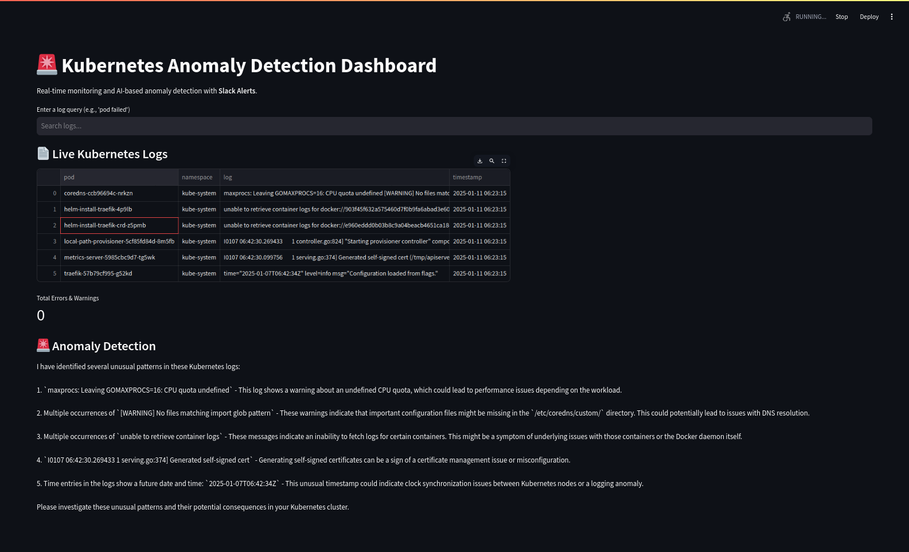

# 🚀 Kubernetes Anomaly Detection Dashboard  
**Real-time AI-powered log monitoring with FAISS and Groq AI, and Prometheus/Grafana**



## **📖 Overview**
This project is a **real-time Kubernetes anomaly detection dashboard** that enables engineers to:
✅ **Fetch logs from all Kubernetes pods dynamically**  
✅ **Search logs instantly using FAISS**  
✅ **Detect anomalies in real-time using TF-IDF & K-Means**  
✅ **Monitor logs & metrics via Prometheus & Grafana**  
✅ **Receive Slack alerts for critical issues**  
✅ **Analyze logs with Groq AI for root cause suggestions**

> **Stop manually searching through thousands of log lines! Use AI to debug Kubernetes efficiently.**

---

## 🛠️ Features  
### 🔍 Log Monitoring & Instant Search  
- Fetches logs from **all namespaces and pods dynamically**.  
- Stores logs as embeddings using **FAISS** for **fast retrieval**.  
- Users can search logs instantly via a **Streamlit UI**.  

### 🧠 AI-Powered & Local Anomaly Detection  
- **TF-IDF & K-Means Clustering** for **local anomaly detection** *(No API cost!)*.  
- **Groq AI integration** for **deeper anomaly analysis & root cause suggestions**.  

### 📡 Real-Time Alerts & Notifications  
- **Slack notifications** for critical anomalies.  
- **Email alerts** for **major incidents**.  
- **Customizable alert thresholds** in `.env`.  

### 📊 Advanced Visualization & Metrics  
- **Real-time error monitoring** via **Streamlit charts & Prometheus/Grafana dashboards**.  
- **Pie charts** for log distribution by **namespace & error type**.  
- **Time-series trend analysis** for anomaly tracking.  


---

## **🚀 Getting Started**
### **🔹 1. Clone the Repository**
```bash
git clone https://github.com/stwins60/k8s-anomaly-detection.git
cd k8s-anomaly-detection
```
### **🔹 2. Install Dependencies**
```bash
pip install -r requirements.txt
```
### **🔹 3. Set Up Environment Variables**
Create a `.env` file in the root directory with the following variables:
```bash
GROQ_API_KEY=your_groq_api_key
GROQ_ENDPOINT=https://api.groq.com/v1/chat/completions
USE_GROQ=True
SLACK_WEBHOOK_URL=your_slack_webhook
EMAIL_ALERTS_ENABLED=True
SMTP_SERVER=smtp.example.com
SMTP_PORT=587
EMAIL_SENDER=alerts@example.com
EMAIL_PASSWORD=your_email_password
EMAIL_RECEIVER=admin@example.com
METRICS_SERVER=True
ANOMALY_THRESHOLD=3
```
### **🔹 4. 🔧 Running the Application**
1. Start the Streamlit Dashboard
    ```bash
    streamlit run app.py
    ```
2. Open the Streamlit UI in your browser: `http://localhost:8501`

### **🔹 5. 📊 Prometheus & Grafana Setup**
This dashboard exposes real-time Kubernetes metrics via Prometheus, which can be visualized in Grafana.
# Prometheus
1. Run Prometheus
    - Install Prometheus
        ```bash
        wget https://github.com/prometheus/prometheus/releases/download/v2.41.0/prometheus-2.41.0.linux-amd64.tar.gz
        tar xvfz prometheus-*.tar.gz
        cd prometheus-* && ./prometheus
        ```
2. Edit `prometheus.yml` and add:
    ```yaml
    scrape_configs:
        - job_name: 'k8s_anomaly_monitoring'
            static_configs:
            - targets: ['localhost:8090']
    ```
3. Start Prometheus
    ```bash
    ./prometheus --config.file=prometheus.yml
    ```
# Run Grafana & Import Dashboard
1. Run Grafana
    ```bash
    docker run -d -p 3000:3000 grafana/grafana
    ```
2. Open Grafana in your browser: `http://localhost:3000`
    - Add Prometheus as a Data Source
    - Create a new dashboard
    - Use the following Prometheus metrics:
        - `kubernetes_anomalies` → Tracks detected anomalies
        - `kubernetes_error_logs` → Monitors error log count
        - `kubernetes_log_count` → Total logs processed

## **📌 How It Works**
1. Fetch Kubernetes Logs
    - The dashboard fetches logs from all pods and namespaces.
    - Logs are stored as embeddings using FAISS for fast retrieval.
2. Search Logs Instantly
    - Users can search logs instantly using the Streamlit UI.
    - FAISS retrieves logs with similar embeddings.
3. AI-Powered Analysis
    - TF-IDF & K-Means Clustering detect unusual logs without external APIs.
    - Groq AI can be enabled for deep anomaly insights.
4. Get Alerts for Critical Issues
    - If an anomaly is detected, Slack alerts notify the team.
    - Email alerts are sent for critical issues.
5. Visualize Logs & Errors
    - Streamlit charts visualize log distribution and anomalies.
    - Prometheus & Grafana dashboards track real-time metrics.

---

## **🎯 Next Steps**

✅ [ ] Add Log Filtering by Pod & Namespace

✅ [ ] Integrate OpenTelemetry for Tracing

✅ [ ] Support Multi-Cluster Monitoring